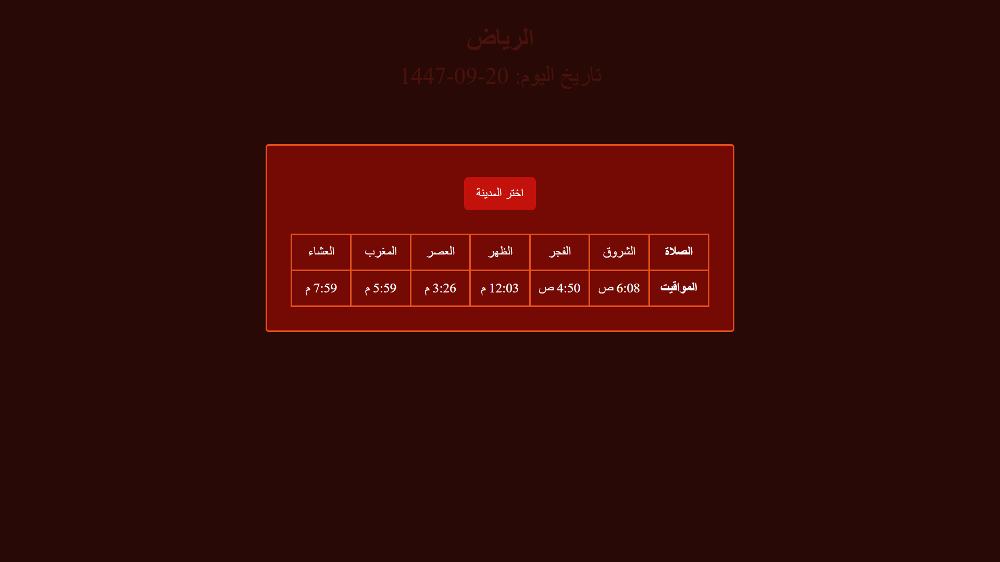

# 🕌 Prayer Times Project

A simple web application that displays **prayer times for cities in Saudi Arabia** using an external API.  
Users can select a city from a dropdown menu, and the prayer times will update automatically.

---

## Screenshot

---

## Live Demo

[Click here to view the project]()

---

## ✨ Features

- Display prayer times for multiple cities
- Dropdown menu to select a city
- Fetch data directly from an API
- Convert time to **12-hour format (AM / PM)**
- Simple and responsive layout

---

## 🛠️ Technologies Used

- **HTML**
- **CSS**
- **JavaScript**
- **Axios** for API requests
- **Aladhan Prayer Times API**

---

## 👩‍💻 Developer

- Hajar Al-Anazi

---

# 🕌 مشروع مواقيت الصلاة

تطبيق ويب بسيط يعرض **مواقيت الصلاة لعدة مدن في السعودية** باستخدام API خارجي.
يمكن للمستخدم اختيار المدينة من قائمة منسدلة، وسيتم تحديث الأوقات تلقائيًا.

---

## لقطة شاشة

---

## العرض المباشر

[اضغط هنا لعرض المشروع]()

---

## ✨ المميزات

- عرض مواقيت الصلاة لعدة مدن
- قائمة منسدلة لاختيار المدينة
- جلب البيانات مباشرة من API
- تحويل الوقت إلى **نظام 12 ساعة (ص / م)**
- تصميم بسيط ومتجاوب مع الجوال

---

## 🛠️ التقنيات المستخدمة

- **HTML**
- **CSS**
- **JavaScript**
- **Axios** لجلب البيانات من API
- **Aladhan Prayer Times API**

---

## 👩‍💻 المطورة

- هاجر العنزي
